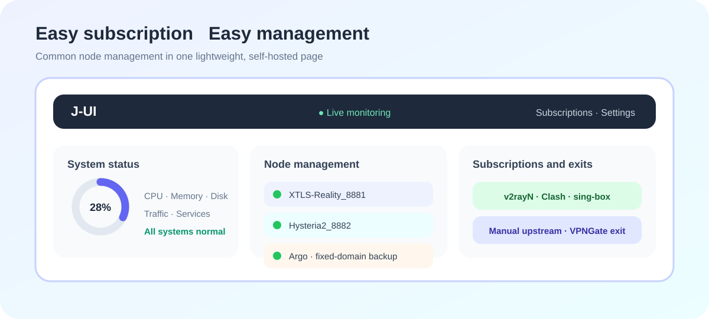
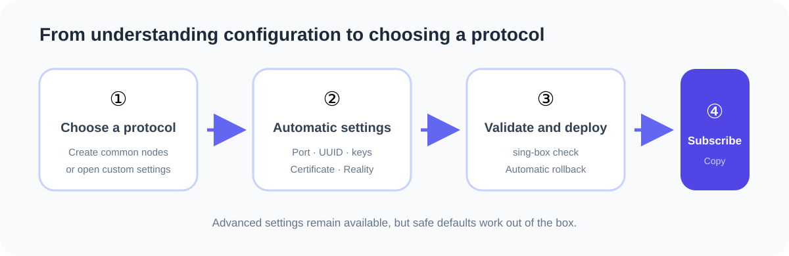
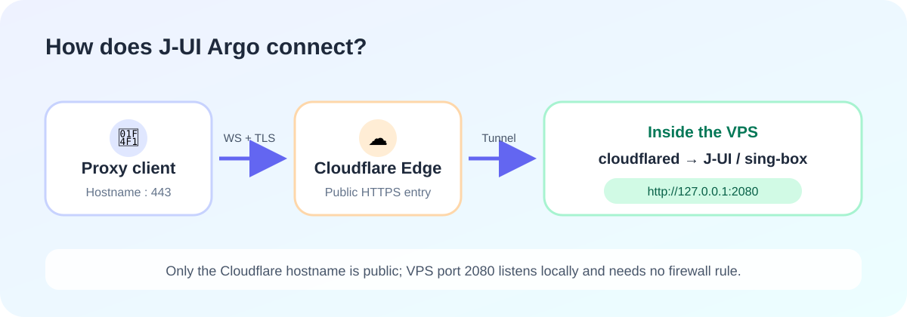
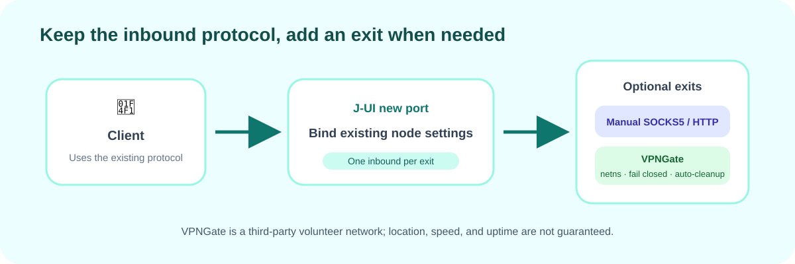

# J-UI

[简体中文](README.md) · [English](README.en.md)

**Easy subscription. Simple control.**

J-UI is a lightweight, self-hosted sing-box management panel for a single Linux VPS. It focuses on what individual users need most—node creation, subscriptions, monitoring, and upstream exits—automating complex settings without removing advanced control.



## Why J-UI

### Choose a protocol instead of writing configuration from scratch

Create common Reality, Hysteria2, and TUIC nodes together, or configure Trojan, gRPC-Reality, AnyTLS, AnyTLS-Reality, VLESS-WS, and fixed-domain Argo individually. J-UI generates ports, UUIDs, passwords, keys, certificates, and recommended settings while keeping advanced options available.



### One subscription for your everyday clients

Export standard Base64, v2rayN, Shadowrocket, Mihomo/Clash YAML, and sing-box JSON subscriptions with matching QR codes. There is no need to rebuild the same node list for every client.

### Visible changes with dependable rollback

The dashboard brings CPU, memory, disk, network, uptime, node, and sing-box status together. Every node change passes candidate generation, `sing-box check`, atomic replacement, and health checks. Failed deployment restores configuration, database state, and firewall rules.

### Fixed-domain Argo as a backup entry

J-UI uses a fixed-domain Cloudflare Tunnel instead of a temporary address that may change after restart. With a restricted API Token and a user-owned subdomain, it creates the Tunnel, DNS record, origin rules, and local service, then performs an end-to-end public check. This provides an authorized backup path when the public entry to user-owned infrastructure is unavailable.

[Illustrated Argo guide](docs/argo-quickstart.en.md) · [中文图文教程](docs/argo-quickstart.zh-CN.md)



### Isolated exits that fail closed

Nodes can bind to a manual SOCKS5/HTTP upstream or a temporary VPNGate exit. VPNGate runs inside an independent network namespace with OpenVPN and fail-closed firewall rules. A failed tunnel remains blocked instead of falling back to the VPS route, and expired resources are removed automatically.



## Requirements

- Debian 11/12 or Ubuntu 22.04/24.04
- Linux `amd64` or `arm64`
- systemd; at least 1 CPU core and 512 MB RAM recommended
- TUN, OpenVPN, nftables, and iproute2 for VPNGate exits

Release packages bundle and verify the designated stable sing-box version. Failed upgrades restore the previous core and configuration.

## Installation

Run as `root` on the VPS:

```bash
curl -fsSL https://raw.githubusercontent.com/Suparluxi/j-ui/main/scripts/install.sh -o /tmp/j-ui-install.sh && bash /tmp/j-ui-install.sh
```

The installer sets up dependencies, sing-box, systemd, firewall rules, and initial data before guiding you through language, public IPv4 address, starting node port, SSL, administrator credentials, and optional BBR + FQ. The final summary prints the management URL and login details.

Argo is optional and not required during the base installation. Configure it later with:

```bash
j-ui argo
```

## Management Commands

```text
j-ui                 Open the interactive management menu
j-ui status          Show service status
j-ui info            Show panel, core, and network information
j-ui log             Show panel and sing-box logs
j-ui restart         Restart the panel, not the server
j-ui reset-password  Reset the administrator password
j-ui ssl             Issue or renew node certificates
j-ui argo            Configure fixed-domain Argo
j-ui backup [path]   Create a backup
j-ui restore <file>  Restore a backup
j-ui update          Update J-UI
j-ui uninstall       Uninstall J-UI
```

The uninstaller can preserve the database and configuration or remove all J-UI-managed programs, services, configuration, keys, runtime data, and backups.

## Security Design

- Session cookies use HttpOnly and SameSite=Strict; state-changing requests require a CSRF header.
- Login failures are rate-limited by source IP, and password changes revoke all sessions.
- Database, instance key, environment files, backups, and Tunnel tokens use restricted file permissions.
- Cloudflare API Tokens are used only during setup and are not stored in the database or logs.
- Production deployments should enable HTTPS and restrict cloud firewall or security-group access.
- VPNGate is a third-party volunteer network; availability, speed, location, and network classification are not guaranteed.
- Backups contain credentials and the instance key and must be treated as sensitive data.

## Development and Testing

```bash
npm --prefix web install
npm --prefix web run build
npm --prefix web test
npm --prefix web run test:e2e
go test ./...
go vet ./...
```

See [AGENTS.md](AGENTS.md) for contribution guidelines.

## License and Acceptable Use

J-UI is source-available software licensed under the [PolyForm Noncommercial License 1.0.0](LICENSE) for noncommercial purposes only. It is not open source under the OSI definition. Third-party components remain subject to their respective licenses; see [Third-Party Notices](THIRD_PARTY_NOTICES.md).

J-UI is intended only for servers controlled by the user or explicitly authorized for their use. It does not provide public nodes or a hosted proxy service. Do not use it for unauthorized access, attacks, fraud, evasion of platform rules, or any other unlawful activity. See the [Legal and Acceptable Use Notice](LEGAL_NOTICE.md).

Copyright © 2026 J-UI contributors.
