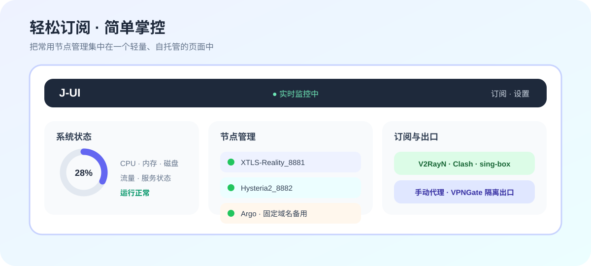
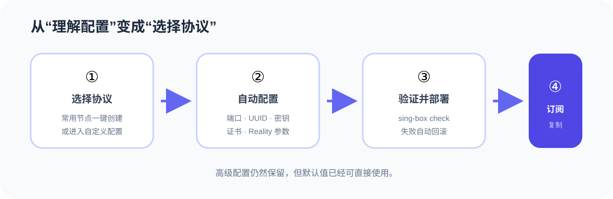
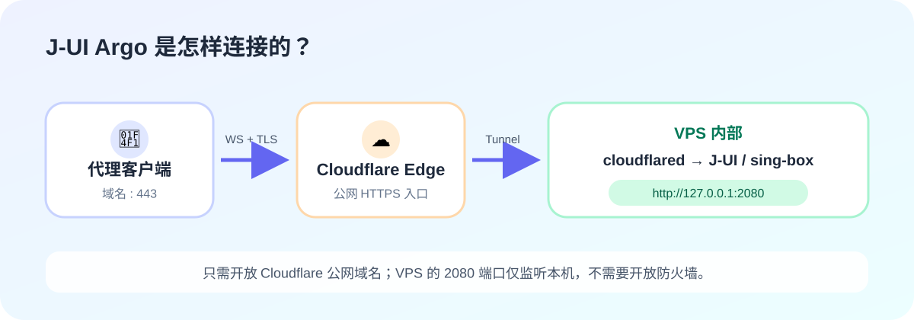
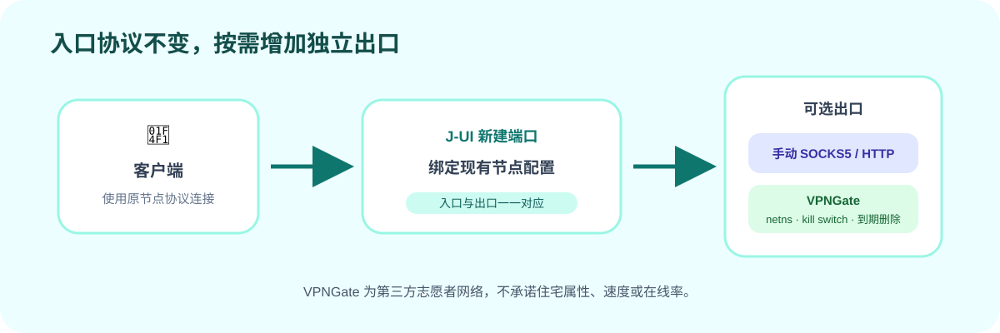

# J-UI

[简体中文](README.md) · [English](README.en.md)

**轻松订阅，简单掌控。**

J-UI 是面向单台 Linux VPS 的轻量级、自托管 sing-box 管理面板。它专注于个人用户真正需要的节点创建、订阅、监控和出口管理：把复杂配置交给系统，同时保留足够的自定义空间。



## 为什么选择 J-UI

### 选择协议，不必从零填写配置

一键创建 Reality、Hysteria2 和 TUIC 常用节点，也可以单独配置 Trojan、gRPC-Reality、AnyTLS、AnyTLS-Reality、VLESS-WS 和固定域名 Argo。端口、UUID、密码、密钥、证书与推荐参数由系统自动生成，高级配置仍可按需调整。



### 一份订阅，连接常用客户端

订阅支持普通 Base64、v2rayN、Shadowrocket、Mihomo/Clash YAML 和 sing-box JSON，并提供对应二维码。无需为每个客户端重复整理节点配置。

### 配置变化看得见，也能安全回退

管理页集中展示 CPU、内存、磁盘、网络、运行时间、节点和 sing-box 状态。每次节点变更都会经过候选配置生成、`sing-box check`、原子替换和健康检查；失败时自动恢复配置、数据库状态与防火墙规则。

### 固定域名 Argo，保留备用入口

J-UI 使用固定域名 Cloudflare Tunnel，不依赖重启后可能变化的临时地址。用户提供受限 API Token 和自有子域名后，系统会创建 Tunnel、DNS、回源规则与本机服务，并完成公网端到端检查，适合作为自有基础设施公网入口异常时的备用访问路径。

[固定域名 Argo 图文教程](docs/argo-quickstart.zh-CN.md)



### 每个出口独立运行，故障时保持流量阻断

节点可以绑定手动 SOCKS5/HTTP 上游，或者创建临时 VPNGate 出口。VPNGate 使用独立 netns、OpenVPN 和阻断式防火墙；隧道异常时保持流量阻断，不会意外回退到 VPS 默认出口，到期后自动关闭并清理相关节点与端口。



## 运行环境

- Debian 11/12 或 Ubuntu 22.04/24.04
- Linux `amd64` 或 `arm64`
- systemd；建议至少 1 核 CPU、512 MB 内存
- VPNGate 功能需要 TUN、OpenVPN、nftables 和 iproute2

J-UI 发布包内置并校验指定的 sing-box 稳定版本，升级失败时自动恢复旧核心和配置。

## VPS 安装

使用 `root` 运行：

```bash
curl -fsSL https://raw.githubusercontent.com/Suparluxi/j-ui/main/scripts/install.sh -o /tmp/j-ui-install.sh && bash /tmp/j-ui-install.sh
```

安装器会完成依赖、sing-box、systemd、防火墙和初始化，再引导配置语言、IPv4 公网地址、节点起始端口、SSL、管理员账号、密码及可选的 BBR + FQ。完成后会显示可直接访问的管理地址和登录信息。

Argo 不在基础安装中强制配置，需要时运行：

```bash
j-ui argo
```

## 管理命令

```text
j-ui                 打开交互式管理菜单
j-ui status          查看服务状态
j-ui info            查看面板、核心与网络信息
j-ui log             查看面板与 sing-box 日志
j-ui restart         重启面板，不重启服务器
j-ui reset-password  重置管理员密码
j-ui ssl             申请或更新节点证书
j-ui argo            配置固定域名 Argo
j-ui backup [路径]   创建备份
j-ui restore <备份>  恢复备份
j-ui update          更新 J-UI
j-ui uninstall       卸载 J-UI
```

卸载时可以选择保留数据库和配置，也可以完整清除 J-UI 管理的程序、服务、配置、密钥、运行数据与备份。

## 安全设计

- Session Cookie 使用 HttpOnly 和 SameSite=Strict，状态修改要求 CSRF Header。
- 登录失败按来源 IP 限速，修改密码后清除全部会话。
- 数据库、实例密钥、环境文件、备份及 Tunnel Token 使用受限文件权限。
- Cloudflare API Token 只在配置期间使用，不写入数据库和日志。
- 管理端正式使用时应启用 HTTPS，并限制云防火墙或安全组访问范围。
- VPNGate 是第三方志愿者网络，其可用性、速度、位置和网络属性均不作保证。
- 备份包含凭据和实例密钥，必须作为敏感数据保存。

## 开发与测试

```bash
npm --prefix web install
npm --prefix web run build
npm --prefix web test
npm --prefix web run test:e2e
go test ./...
go vet ./...
```

贡献规范见 [AGENTS.md](AGENTS.md)。

## 许可证与使用边界

J-UI 采用 [MIT License](LICENSE) 开源发布。你可以使用、修改、分发和再许可 J-UI，但必须保留版权和许可声明。第三方组件继续适用各自的许可证，详见[第三方软件声明](THIRD_PARTY_NOTICES.md)。

J-UI 只用于管理使用者自行控制或已获得明确授权的服务器，不提供公共节点或托管代理服务。请勿用于未授权访问、攻击、欺诈、规避平台规则或其他违法活动。完整条款见[法律与使用声明](LEGAL_NOTICE.md)。

Copyright © 2026 J-UI contributors.
