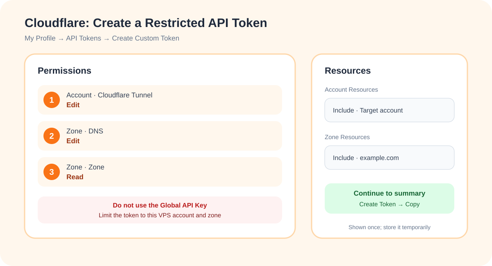
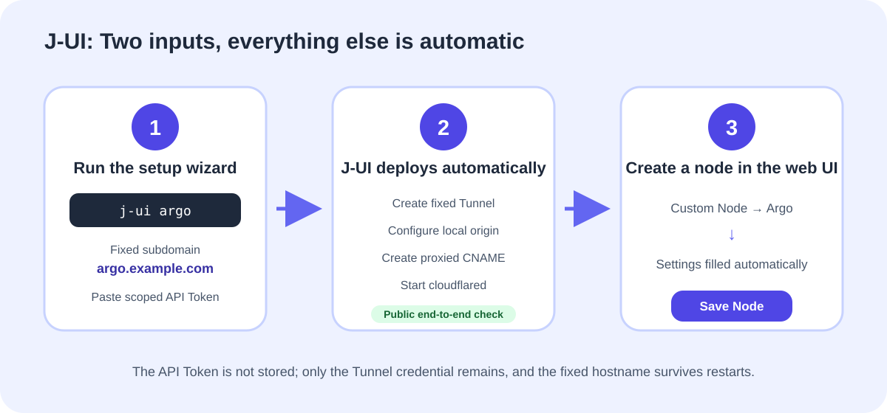

# J-UI Fixed-Domain Argo: Illustrated Quickstart

Argo is J-UI's **backup connection**. When the public entry to your own infrastructure is unavailable, an authorized client can still reach the VPS through a fixed Cloudflare hostname. J-UI uses a fixed-domain Cloudflare Tunnel instead of a `trycloudflare.com` temporary tunnel.

You need:

- A domain already managed by Cloudflare, such as `example.com`;
- An unused subdomain, such as `argo.example.com`;
- A Cloudflare API Token limited to the target account and zone;
- Root access to the VPS.


## Step 1: Create a restricted Cloudflare API Token

### 1. Open the API Token page

Sign in to the [Cloudflare Dashboard](https://dash.cloudflare.com/), click your avatar, and open:

```text
My Profile → API Tokens → Create Token → Create Custom Token
```

Do not use the **Global API Key**.

### 2. Add the three permissions

| Scope | Permission | Level |
| --- | --- | --- |
| Account | Cloudflare Tunnel (some dashboards show Cloudflare One Connectors: cloudflared) | Edit |
| Zone | DNS | Edit |
| Zone | Zone | Read |

### 3. Limit the resources

```text
Account Resources: Include → select the target account
Zone Resources: Include → Specific zone → example.com
```

Do not select all accounts or all zones. Choose **Continue to summary → Create Token**, then copy the token. Cloudflare shows it only once. Keep it locally; do not screenshot it, send it to anyone, or upload it to GitHub.



Cloudflare setup is complete at this point. You do **not** need to create the Tunnel, CNAME, or published application manually.

## Step 2: Let J-UI configure Argo

### 1. Run the wizard on the VPS

```bash
j-ui argo
```

Enter the following values when prompted:

```text
Fixed Argo subdomain: argo.example.com
Local origin port: press Enter to use 2080
Cloudflare API Token: paste the token you just created
```

Token input is hidden. Paste it and press Enter. J-UI then automatically:

1. Confirms that the hostname belongs to Cloudflare and identifies the Account and Zone;
2. Creates a fixed-name Tunnel;
3. Configures `argo.example.com → http://127.0.0.1:2080` as the origin;
4. Creates a proxied CNAME;
5. Installs and starts `cloudflared`;
6. Runs an end-to-end check through the public hostname.



The setup is successful only when you see:

```text
Fixed-domain Argo configured; the Argo protocol is now enabled in the web panel.
```

The API Token is not written to the J-UI configuration. After setup, you may revoke it from Cloudflare's API Tokens page; the fixed Tunnel will continue to run.

### 2. Create an Argo node in the web panel

Refresh J-UI and open:

```text
Custom Node → Argo → Confirm → Save Node
```

J-UI fills in the fixed hostname, `127.0.0.1`, origin port, WebSocket path, and UUID. Do not change the origin port to `443`, and do not change the listen address to `0.0.0.0`.

### 3. Refresh the client subscription

Open **Subscription Links** at the top of J-UI, copy the subscription format for your client, and refresh it. The exported Argo node should use:

```text
Address: argo.example.com
Port: 443
Transport: WebSocket
TLS: enabled
SNI / Host: argo.example.com
Path: /jui-argo
```

## Troubleshooting

### “Cloudflare Zone not found”

Confirm that the domain uses Cloudflare nameservers and that the token has `Zone: Read` permission for the target zone.

### “The subdomain has DNS not managed by J-UI”

To avoid overwriting a website, J-UI does not replace unknown DNS records. Use a new subdomain, such as `argo2.example.com`, or remove the conflicting record in Cloudflare after confirming it is no longer needed.

### “A cloudflared service not managed by J-UI already exists”

The existing Tunnel may serve another website. Check its purpose before changing it. J-UI will not overwrite another service automatically.

### Migrating from a manually configured Argo

Older configurations may not contain the remote Tunnel and DNS resource IDs. J-UI will not guess ownership or overwrite those resources. Use a new subdomain first; after the new node works, remove the old Tunnel and CNAME from the Cloudflare Dashboard. Reuse an old hostname only after confirming that it serves no other application and cleaning up its conflicting DNS record.

### Argo is still disabled

Argo is enabled only after the public end-to-end check succeeds. Inspect the service with:

```bash
systemctl status cloudflared --no-pager
journalctl -u cloudflared -n 100 --no-pager
```

If setup still fails, collect a sanitized cloudflared service status and the latest 100 log lines before opening an issue in the repository.
