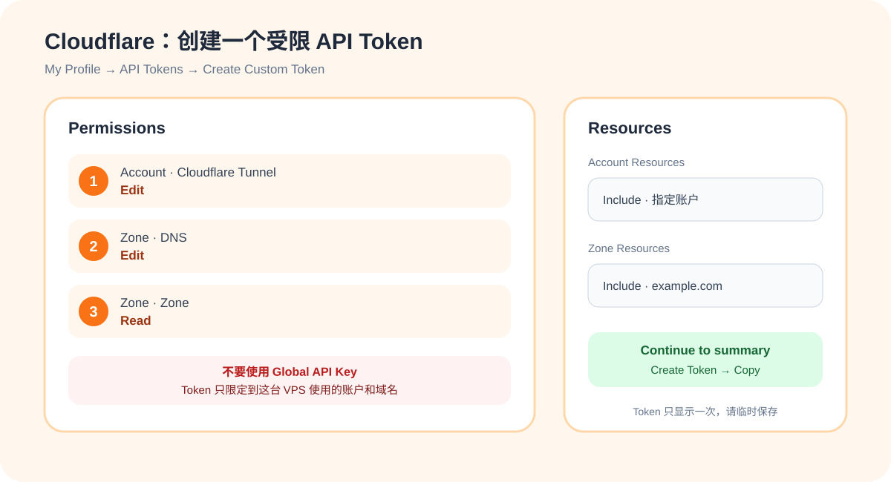
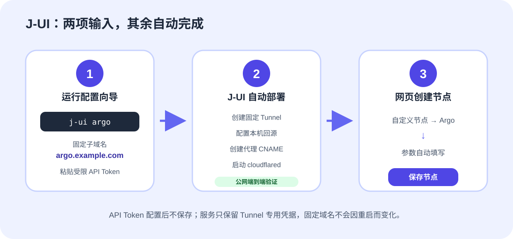

# J-UI 固定域名 Argo 图文教程

Argo 是 J-UI 的**备用连接**：当自有基础设施的公网入口异常时，客户端仍可通过 Cloudflare 固定域名访问已获授权的 VPS。J-UI 不使用会随重启变化的 `trycloudflare.com` 临时隧道，只配置固定域名 Cloudflare Tunnel。

你只需要准备：

- 一个已经托管到 Cloudflare 的域名，例如 `example.com`；
- 一个未被占用的子域名，例如 `argo.example.com`；
- 一个仅允许管理该账户和域名的 Cloudflare API Token；
- VPS 的 root 权限。


## 步骤一：在 Cloudflare 创建受限 API Token

### 1. 打开 API Token 页面

登录 [Cloudflare Dashboard](https://dash.cloudflare.com/)，点击右上角头像，进入：

```text
配置文件 → API令牌 → 创建令牌 → 创建自定义令牌
```

不要使用 **Global API Key**。

### 2. 添加三项权限

| 类型 | 权限项目 | 级别 |
| --- | --- | --- |
| 账户 | Cloudflare Tunnel（部分界面显示 Cloudflare One 连接器：Cloudflared） | 编辑 |
| 区域 | DNS | 编辑 |
| 区域 | 区域 | 读取 |

### 3. 限定资源范围

```text
账户资源：包括 → 选择目标账户
区域资源：包括 → 特定区域 → example.com
```

不要选择所有账户、所有区域。点击 **继续以显示摘要 → 创建令牌**，复制生成的 令牌。令牌 只显示一次，暂时保存在本地，不要截图、发送给他人或上传 GitHub。



Cloudflare 端到这里就完成了。你**不需要**手工创建 Tunnel、CNAME 或 Published application。

## 步骤二：让 J-UI 自动配置并创建节点

### 1. 在 VPS 运行向导

```bash
j-ui argo
```

按提示输入：

```text
Argo 固定子域名：argo.example.com
本机回源端口：直接回车使用 2080
Cloudflare API Token：粘贴刚才创建的 Token
```

Token 输入时不会显示字符，粘贴后直接回车。J-UI 随后自动完成：

1. 确认域名已托管到 Cloudflare，并识别 账户 和 区域；
2. 创建固定名称 Tunnel；
3. 配置 `argo.example.com → http://127.0.0.1:2080` 回源；
4. 创建已代理的 CNAME；
5. 安装并启动 `cloudflared`；
6. 通过公网域名执行端到端检测。



出现以下提示才表示成功：

```text
固定域名 Argo 配置完成，网页端 Argo 协议现已解锁。
```

API令牌 不会写入 J-UI 配置。成功后建议返回 Cloudflare 的 API令牌 页面撤销它；固定 Tunnel 仍会继续运行。

### 2. 在网页创建 Argo 节点

刷新 J-UI，点击：

```text
自定义节点 → Argo → 确定 → 保存节点
```

J-UI 会自动填写固定域名、`127.0.0.1`、回源端口、WebSocket Path 和 UUID。不要把回源端口改成 `443`，也不要把监听地址改成 `0.0.0.0`。

### 3. 刷新客户端订阅

打开顶部的 **订阅链接**，复制对应客户端订阅并刷新。导出的 Argo 节点应为：

```text
地址：argo.example.com
端口：443
传输：WebSocket
TLS：开启
SNI / Host：argo.example.com
Path：/jui-argo
```

## 常见问题

### 提示“无法找到 Cloudflare Zone”

确认域名已经使用 Cloudflare Nameserver，并检查 令牌 是否具有目标 区域 的 `区域:读取` 权限。

### 提示“子域名已有非 J-UI 管理的 DNS”

为防止覆盖网站，J-UI 不会自动替换未知 DNS。请改用新的子域名，例如 `argo2.example.com`，或确认无用后在 Cloudflare 删除冲突记录。

### 提示存在非 J-UI 管理的 cloudflared 服务

这表示 VPS 上的 Tunnel 可能还承载其他网站。J-UI 不会强行覆盖它；请先确认用途，避免中断其他服务。

### 从旧版手工 Argo 迁移

旧版配置没有记录远端 Tunnel 和 DNS 的资源 ID，J-UI 不会猜测归属或直接覆盖。请优先为新版使用一个新的子域名；确认新节点可用后，再到 Cloudflare Dashboard 删除旧 Tunnel 和旧 CNAME。若必须复用原子域名，请先确认它没有承载其他服务，再手工删除对应 DNS 记录后重新运行 `j-ui argo`。

### Argo 仍然是灰色

只有公网端到端检测成功才会解锁。查看：

```bash
systemctl status cloudflared --no-pager
journalctl -u cloudflared -n 100 --no-pager
```

如仍无法完成配置，请保留脱敏后的 cloudflared 服务状态和最近 100 行日志，再到仓库提交 Issue。
